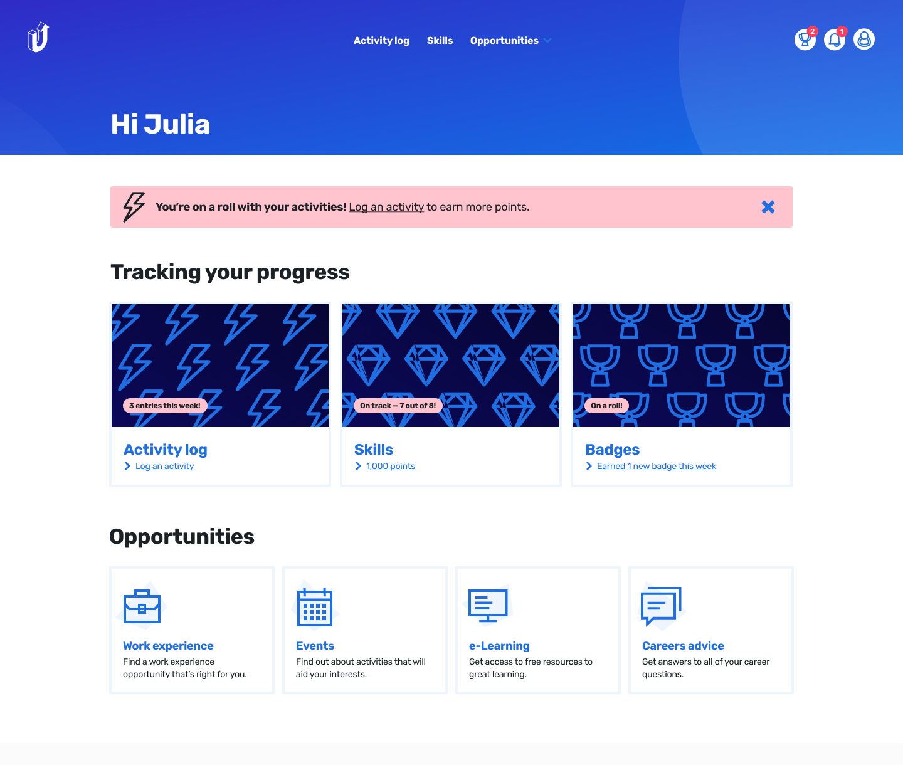

The goal of Upskill Me is to help everyone gain new skills. This is our help center for using the platform which answers frequent questions and provides tips for our users.

## Developing Skills?

Upskill Me partners with UK schools to help students aged 11 to 18 prepare for their next steps.

To be successful today, students need more than just good grades. They need to build sought-after interpersonal skills that they can take into jobs and universities. That’s where Upskill Me comes in: our platform helps students develop and record these skills. Students can also record their achievements, and connect with employers, events, and courses. Through Upskill Me, young people succeed.

## What is it exactly?

To keep up with our rapidly changing world, students need to build critical skills like problem-solving, teamwork and creativity.

With Upskill Me, students can track their skill development, earning badges as they go. They can record any awards they’ve won, certificates achieved, or projects they’re proud of - both in and out of school. So when they’re applying for jobs and further education, they’ve got everything they need. It’s all in one place.

## What you might want to read next

- [Tutorial showing how to set up your own Help Center](/articles/setup)
- [Features of this help center](/collections/features-and-nonfeatures)
- [Comparison to paid SaaS projects](/articles/comparison-to-saas)
